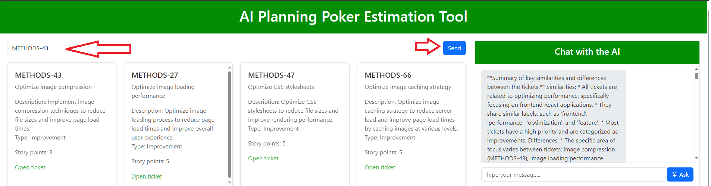
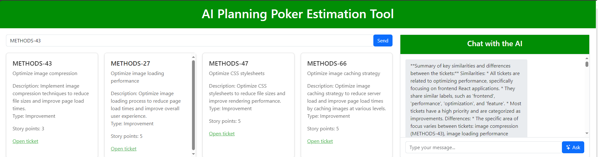
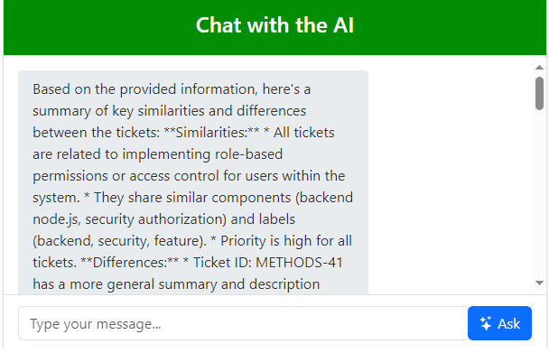

# Planning Poker com Assistente de IA

## Visão geral
Projetada como trabalho da disciplina de metodologias ágeis da UTFPR, o Planning Poker com Assistente de IA é uma ferramenta projetada para ajudar equipes de desenvolvimento de software a estimar o esforço necessário para tarefas do Scrum. O sistema utiliza IA para fornecer contexto e orientação com base em tickets semelhantes anteriormente tratados pela equipe, melhorando a precisão e eficiência do processo de estimativa.

## Features
- **Gerenciamento de Tickets**: Com dados de tickets.
- **Vectorization**: Converter descrições de tickets em representações vetoriais para busca de similaridade.
- **Busca por similaridade**: Encontrar os 3 tickets mais semelhantes usando similaridade vetorial, a partir da base de dados FAISS.
- **Assistência por IA generativa**: Gerar contexto e orientação com base em tickets semelhantes usando a IA generativa, assim como fazer perguntas baseadas no contexto.
- **Integração com Planning Poker**: Integrar insights gerados pela IA no fluxo de trabalho do Planning Poker.

## Arquitetura
O projeto consiste nos seguintes componentes:

1. **Frontend**: Interface de usuário para estimativa de tickets via Planning Poker tradicional, possibilidade de visualizar tickets semelhantes e exibir o contexto gerado pela IA juntamente com o chat conversacional.
2. **Backend**: Servidor API para lidar com requests, integrando-se com o banco de dados vetorial e interagindo com o modelo de IA.
3. **Vector Database**: Armazena representações vetoriais dos tickets para busca de similaridade. Implementado com FAISS.
4. **Modelo generativo**: Gera contexto e orientação com base em tickets semelhantes. Pode utilizar qualquer modelo que seja possível rodar com o Ollama.

## Primeiros Passos para rodar o projeto

### Pré-requisitos
- [Python 3](https://www.python.org/downloads/)
- [Docker](https://docs.docker.com/get-docker/)
- [Ollama](https://ollama.com/download)
- Placa de vídeo NVIDIA com pelo menos 4 GB de VRAM

### Instalando o Ollama

### Instalação

1. **Clonar o Repositório**
    ```sh
    git clone https://github.com/your-username/planning-poker-with-llm.git
    cd planning-poker-with-llm
    ```

2. **Instalar Dependências do Backend**
    ```sh
    pip install -r requirements.txt
    ```

### Executando a Aplicação

1. **Iniciar o container com a base de dados**
    Abra um novo terminal no projeto e execute o seguinte comando:
    ```sh
    cd docker && docker-compose up
    ```

2. **Popular a base de dados**
    Caso seja a primeira vez rodando o projeto, é necessário executar o seguinte script:
    ```sh
    python ./docker/populate_database.py
    ```

3. **Iniciar o projeto python**
    Nesta e nas seguintes execuções, execute o seguinte comando:
    ```sh
    cd backend && python ./app.py
    ```

A aplicação deve estar rodando agora em `http://localhost:5000`.

## Passo a passo de como usar o projeto

1. **Busca de Ticket**: Insira o ID do ticket que está sendo estimado no momento e envie-o.  \


2. **Vetorização e Busca por Similaridade**: O sistema obtém as informações do ticket consultando na base de dados SQL e depois, utiliza a base de dados vetorizada para buscar pelos 4 tickets mais semelhantes e os recupera como cartões, monstrando na interface.  \


3. **Assistência Contextual de IA**: O modelo de IA analisa os tickets semelhantes e gera contexto e orientação para estimar o novo ticket.  \


4. **Sessão de Planning Poker**: Os insights gerados pela IA são exibidos durante a sessão de Planning Poker para ajudar a equipe a estimar o ticket.
